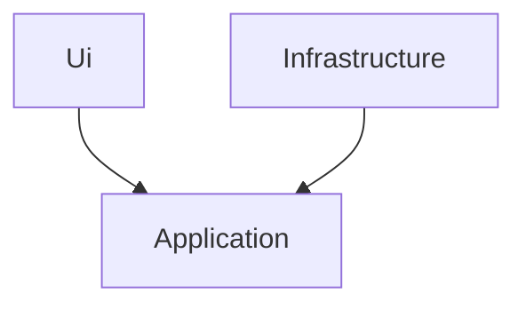

> [!WARNING]
> Ce projet contient du pseudocode qui ne fonctionne pas.
>
> Il est seulement présent pour illustrer les propos de la conférence qui a eu lieu le 24 mai
> pour l'AFUP Day 2024.

Voici un exemple des couches que l'on peut utiliser pour implémenter une architecture hexagonale :

- `Ui` : Contient les ports primaires de notre architecture hexagonale, 
  ici, nous avons un port HTTP et un port CLI.
- `Application` : C'est ici que résident l'intérieur de notre application, c'est la couche qui contient
  la logique métier que l'on veut isoler. Cette couche contient un modèle anémique.
- `Infrastructure` : C'est tout le reste de l'application, y compris l'implémentation
  des ports secondaires.

Le style d'une architecture hexagonale est bien respecté, mais la logique métier
est perdue dans les classes de service (l'API de la couche `Application`).
On risque également de dupliquer cette logique métier lorsqu'on aura des
cas d'utilisation qui requièrent des comportements similaires.

La commande et le contrôleur sont devenues bien plus simples. 
Leur seul rôle est désormais de mapper les interactions de l'utilisateur
pour établir la communication qu'il faut avec la couche Application.
