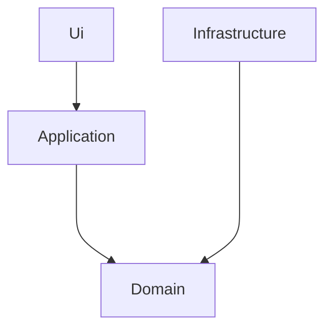

> [!WARNING]
> Ce projet contient du pseudocode qui ne fonctionne pas.
>
> Il est seulement présent pour illustrer les propos de la conférence qui a eu lieu le 24 mai
> pour l'AFUP Day 2024.

La dernière étape consiste à ajouter un modèle de domaine riche, comme le prévoit DDD, à notre
architecture hexagonale. Pour ce faire, nous ajoutons une couche `Domain` qui est la couche 
la plus basse et qui ne dépend donc de rien (sauf de quelques bibliothèques judicieusement choisies).

- `Ui` : Regroupe les ports primaires de notre architecture hexagonale, 
  ici, nous avons un port HTTP et un port CLI
- `Application` : C'est l'intérieur de notre application, c'est la couche qui va isoler notre logiciel de l'extérieur.
- `Infrastructure` : C'est tout le reste du logiciel, y compris l'implémentation
  des ports secondaires
- `Domain` : C'est ici que réside notre logique métier, définie à partir d'un modèle riche.
  Rappelons que l'essence de la POO est de combiner comportement et data.
  L'intérêt est double, factoriser les règles métiers et garantir l'intégrité des 
  données manipulées.

Bon, ça fait beaucoup de classes en plus tout cela ! C'est vrai ! Et c'est
souvent la raison pour laquelle on accuse l'architecture hexagonale de lourdeur et/ou de complexité.
Par transitivité, comme DDD est fréquemment associé à une archi hexa, on dit la même
chose de DDD. Mais nous l'avons vu : il est plutôt simple d'utiliser un domain model
riche. La complexité arrive plutôt dans les cas où l'on veut utiliser notre framework
préféré pour certaines tâches où ce dernier va préférer un bon vieux modèle anémique.
L'utilisation de DTO permet de résoudre une grande partie de ces cas-là au prix 
d'un peu de mapping entre objets.

En réalité, on appréhende très rapidement cette architecture, on trouve vite ses marques.
La charge mentale est même réduite, car à chaque couche du code, on va résoudre une
problématique unique :
- Dans la `Ui`, on interprête les données reçues
- Dans l'`Application` on orchestre la demande reçue 
- Dans le `Domain` on implémente nos règles métiers
- Dans l'`Infrastructure` on implémente des adaptateurs secondaires 

=> On a un cadre clair et précis pour ranger notre code par responsabilité

Pour conclure : 
1. L'architecture hexagonale est excellent moyen d'isoler un domain model DDD
2. La plus grande difficulté vient du domain model ! Faire un modèle adapté à son
contexte, performant et qui aligne le business et la tech est un gros challenge
qui demande beaucoup d'expériences ; surtout quand le domaine en question est complexe. 
Mais il ne faut pas rester bloqué pour autant. C'est l'un des grands messages d'Eric Evans, 
la modélisation DDD est itérative. Le temps permet d'affiner la compréhension du domaine de l'entreprise et in-fine, de créer un
modèle plus adapté aux besoins de celle-ci. Des tests unitaires bien écrits sont 
l'outil qui permet ce refactoring continu du domain model.
