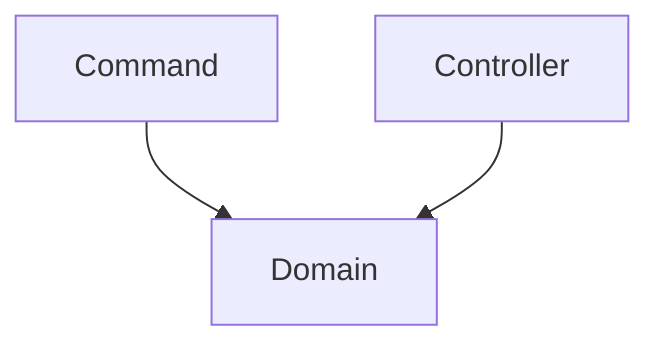

> [!WARNING]
> Ce projet contient du pseudocode qui ne fonctionne pas.
>
> Il est seulement présent pour illustrer les propos de la conférence qui a eu lieu le 24 mai
> pour l'AFUP Day 2024.

La branche actuelle illustre l'utilisation d'un modèle riche dans le framework Symfony.

Le domain model est isolé dans une couche appelée `Domain`. C'est la couche la plus basse.
Elle est donc isolé des autres couches.

On remarquera qu'il y a du code dupliqué entre la commande et le controller.

Ce n'est pas du code métier qui est dupliqué : c'est du code de persistance et d'orchestration.

Cette approche peut avoir plusieurs problèmes :
- on peut vite créer une dette technique importante comparée à un projet
où le découplage et la factorisation a été bien pensé.
- on aura plus de difficulté à écrire des tests unitaires.
- le cadre est très libre ce qui laisse plus de place aux erreurs d'architecture.

Néanmoins, le simple fait d'utiliser un domain model riche est un avantage qui 
va éviter d'éparpigner et/ou dupliquer la logique métier de l'application dans toutes
les couches. C'est le principe DRY (Don't Repeat Yourself) qui est respecté.
